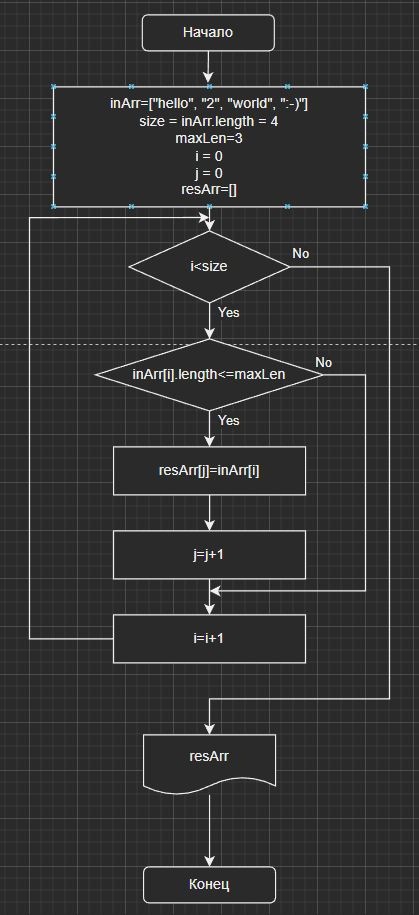

Итоговая проверочная работа
===========================

Задача:
-------
Написать программу, которая из имеющегося массива строк формирует массив из строк, длина которых меньше либо равна 3 символа. Первоначальный массив можно ввести с клавиатуры, либо задать на старте выполнения алгоритма.

Примеры:
--------

["hello","2","world",":-)"] -> ["2",":-)"]

["1234","1567","-2","computer science"] -> [-2]

["Russia","Denmark","Kazan"] -> []

Решение:
--------
Пройдем массив строк от начала до конца, сравнивая длинну строки каждого элемента массива с максимально заданной(3). Если длина меньше или равна максимально заданной, то добавим этот элемент в результирующий массив.

Блок - схема
------------
